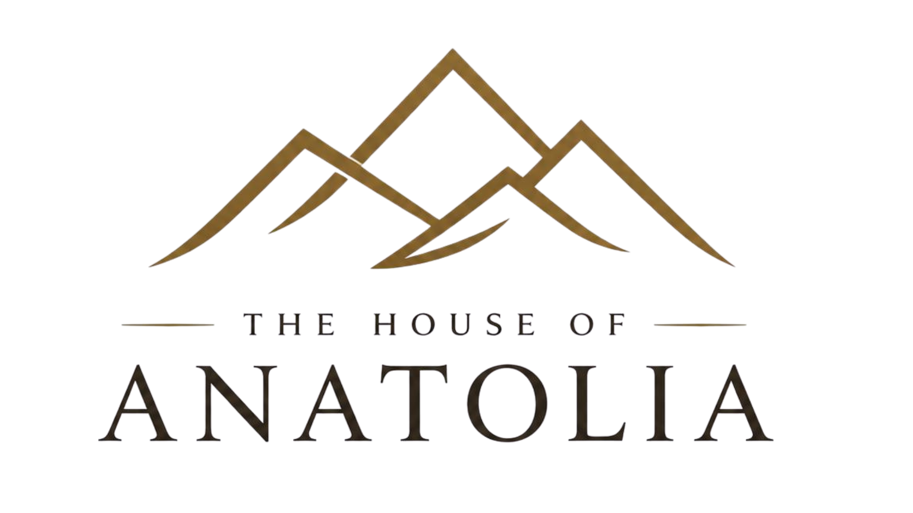

# DESIGN SYSTEM — The House of Anatolia

> **Aesthetic direction:** "Editorial Heritage — Anatolian terroir meets refined modernism"
> **2026-05-08 güncel — frontend-design skill ilkeleri uygulanmıştır**

---

## 🎨 Renk Paleti

```css
:root {
  /* Zemin — koyu */
  --bg:         #0a0807;
  --bg-soft:    #120e0c;
  --panel:      #15110e;
  --panel-soft: #1c1612;

  /* Krem (cream) tonları */
  --cream:   #efe9dd;
  --cream-2: #e5ddd0;
  --text:    #f4eee6;
  --muted:   #c2b4a4;

  /* Çizgiler */
  --line: rgba(255,255,255,.08);

  /* Altın aksanlar — TEK accent rengi */
  --gold:      #d2a12f;
  --gold-soft: #f0d28a;
  --warm:      #8a5225;

  /* Easing — Apple/Aesop favorisi */
  --ease: cubic-bezier(0.16, 1, 0.3, 1);
  --max:  1320px;
}
```

### KESİN KURAL — Renk Disiplini
**Sadece koyu + altın + krem tonları kullanılır.** Mavi, yeşil, kırmızı, mor — hiçbiri yok. Tek vurgu rengi: altın. AI-cliché purple gradient'ler yasak.

---

## 📝 Tipografi

### Fontlar (frontend-design skill uyumlu)
```css
--font-display: 'Cormorant Garamond', serif;       /* Başlıklar, italic accents */
--font-body:    'Plus Jakarta Sans', sans-serif;    /* Body, UI, modern */
```

**Inter, Roboto, Arial, system fonts YASAK** — frontend-design skill direktifi (generic AI slop).

### Google Fonts URL
```html
<link rel="preconnect" href="https://fonts.googleapis.com">
<link rel="preconnect" href="https://fonts.gstatic.com" crossorigin>
<link href="https://fonts.googleapis.com/css2?family=Cormorant+Garamond:wght@400;500;600;700&family=Plus+Jakarta+Sans:wght@400;500;600;700;800&display=swap" rel="stylesheet">
```

### Font Features (refined typography)
```css
body {
  font-feature-settings: "ss01","cv11";  /* Plus Jakarta Sans alternates */
  -webkit-font-smoothing: antialiased;
  -moz-osx-font-smoothing: grayscale;
}
h1, h2, h3, .title {
  font-feature-settings: "liga","dlig","kern";  /* Cormorant ligatures */
  letter-spacing: -.005em;
  text-wrap: balance;
}
```

### Hiyerarşi
```css
/* Display H1 */
font-family: 'Cormorant Garamond', serif;
font-size: clamp(46px, 7vw, 96px);
font-weight: 300;
line-height: 1.04;

/* H2 — section başlıkları */
font-size: clamp(36px, 4.5vw, 56px);
font-weight: 500;

/* Italic gold accent (slogan) */
font-style: italic;
color: var(--gold-soft);
font-weight: 400;

/* Eyebrow / kicker */
font-size: 0.7rem;
letter-spacing: 0.22em;
text-transform: uppercase;
color: var(--gold-soft);

/* Body */
font-family: 'Plus Jakarta Sans', sans-serif;
font-size: 1rem;
line-height: 1.85;
color: rgba(244, 238, 230, .68);
```

---

## ✨ Atmospheric & Motion

### SVG Film Grain (body background)
```css
body::after {
  content: "";
  position: fixed;
  inset: 0;
  pointer-events: none;
  z-index: 1;
  opacity: 0.035;
  mix-blend-mode: overlay;
  background-image: url("data:image/svg+xml;utf8,<svg ...fractalNoise...>");
}
@media (prefers-reduced-motion: reduce) { body::after { display: none } }
```

### Gold Sparkle Particles (.gold-sparkle)
- Map alanında periyodik random spawn (350ms aralık)
- 3px altın nokta + 4-yön ışın (pseudo elements)
- Animation: scale + rotate + translateY drift
- Her sparkle 1.6-3.8s yaşıyor
- prefers-reduced-motion saygılı

### Custom Scrollbar
```css
* { scrollbar-width: thin; scrollbar-color: rgba(210,161,47,.45) rgba(20,15,10,.4); }
*::-webkit-scrollbar { width: 9px; }
*::-webkit-scrollbar-thumb { background: gold gradient; }
*::-webkit-scrollbar-thumb:hover { brightening }
```

### ::selection
```css
::selection { background: rgba(210,161,47,.28); color: var(--cream) }
```

### Hover/Focus Surprise
```css
/* Nav links — orta noktadan çift yönlü altın underline */
.nav-links a::before {
  position: absolute; left: 50%; right: 50%; bottom: -6px;
  height: 1px; background: var(--gold);
  transition: left .45s var(--ease), right .45s var(--ease);
}
.nav-links a:hover::before { left: 0; right: 0 }

/* Form input focus-visible — altın 3px glow ring */
input:focus-visible, textarea:focus-visible, select:focus-visible {
  box-shadow: 0 0 0 3px rgba(210,161,47,.18);
}

/* Reveal animation */
.reveal {
  opacity: 0;
  transform: translateY(28px) scale(.998);
  transition: opacity 1s var(--ease), transform 1s var(--ease);
}
.reveal.in-view { opacity: 1; transform: none }
```

---

## 📐 Spacing & Layout

### Container
```css
.container { width: min(calc(100% - 48px), 1320px); margin: 0 auto }
@media (max-width: 980px) { .container padding: 0 28px }
@media (max-width: 480px) { .container width: min(calc(100% - 32px), 1320px) }
@media (min-width: 1600px) { .container padding: 0 80px }
```

### Section Padding
```css
.section { padding: 110px 0 }
@media (max-width: 980px) { .section { padding: 60px 0 } }
@media (max-width: 480px) { .section { padding: 48px 0 } }
```

### Grid'ler
- **Asymmetric (1.2fr 0.8fr)** — Aesop tarzı; bu projede kullanıldı sonra **kullanıcı reddetti**, kullanma
- **Eşit ikili (1fr 1fr)**
- **3'lü (repeat(3, 1fr))**
- **4'lü footer (1.4fr 1fr 1fr 1.2fr)** — hafif asymmetric

---

## 🎯 Beğenilen Component'ler

### Italic Gold Accent (slogan vurgusu)
```html
<h1>Lezzetin <em>Kökenine</em> Yolculuk</h1>
```
i18n marker syntax: `*X*` JS tarafından `<em class="gold-accent">X</em>` olarak parse edilir.

### Eyebrow
```html
<div class="eyebrow"><span class="eyebrow-line"></span><span>HİKÂYEMİZ</span></div>
```

### Section Divider (◆)
```html
<div class="container"><div class="section-divider" aria-hidden="true"><span class="diamond">◆</span></div></div>
```

### Future Pill
```html
<span class="future-pill">Yakında — Kastamonu Sarımsağı</span>
```
Border + altın ton, hafif altın background.

### Footer Brand Logo
```html
<a href="#home" class="footer-brand-logo">
  
</a>
```
64px height, drop-shadow, hover translateY(-2px).

---

## 🚫 Yasaklar (frontend-design skill direktifi)

1. ❌ **Inter, Roboto, Arial, system-ui** — generic AI slop
2. ❌ **Purple gradients** (özellikle white background üstünde)
3. ❌ **Predictable layouts** (cookie-cutter Bootstrap)
4. ❌ **3-sütun dikey label/value** (kullanıcı reddetti)
5. ❌ **Stats bar 1/1/1 sayım kartları** (kullanıcı: "ucuz duruyor")
6. ❌ **KÜNYE bilgi kartları** (kullanıcı reddetti)
7. ❌ **Sertifika rozeti** (kullanıcı reddetti)
8. ❌ **Cinematic dağ silüetleri** (kullanıcı reddetti)
9. ❌ **Border-radius bombardımanı** — köşe %0 veya max 4px
10. ❌ **Drop shadow abartısı** — sadece var(--shadow) veya gold glow
11. ❌ **Emoji ikonlar** — yerine SVG veya `✦ ❋ ※`
12. ❌ **Auto-play video / ses**
13. ❌ **Stock fotoğraf hissi**

---

## ✅ Olmazsa Olmaz

1. ✓ **Boşluk hakimiyeti** — section padding 60-110px
2. ✓ **Tek easing** — `cubic-bezier(0.16, 1, 0.3, 1)`
3. ✓ **İnce çizgiler** — 1px gold border/divider
4. ✓ **İtalik altın vurgular** — başlıklarda 1 kelime
5. ✓ **Atmospheric depth** — film grain noise + radial gradients
6. ✓ **Mobile-first** — clamp() fluid type, no overflow
7. ✓ **prefers-reduced-motion saygısı**
8. ✓ **Touch-friendly** — 44px+ targets
9. ✓ **Section labels** — eyebrow + line + caps text

---

## 🎯 Stil Referansları

- **Aesop** — asymmetric grids (kullanıcı reddetti, ama tipografi yön doğru)
- **Hermès Maison** — cinematic hero (büyük dağ silüeti reddedildi, ama editorial yön doğru)
- **Le Labo** — typography-first, brutal minimalism
- **Mariage Frères** — heritage, certifications

**Özetle:** "Boş ama dolu" — az element, ama her element premium hissi versin.
